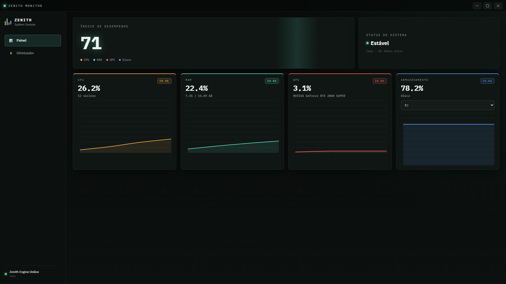

# ⚡ Zenith Monitor

**Console de telemetria e otimização para Windows.** Monitoramento de CPU, RAM, GPU e disco em tempo real, com ferramentas reais de otimização do sistema — sem telemetria falsa, sem "limpeza mágica": cada métrica e cada ação usa a API do Windows de verdade.

Construído com Electron + JavaScript puro.


---

## 📸 Screenshots

<p align="center">
  
</p>

---

## ✨ Funcionalidades

### Painel (Dashboard)

- **CPU, RAM, GPU e Disco** em tempo real, atualizados a cada segundo
- Gráficos de histórico (últimos 60 pontos) por métrica
- Índice de desempenho calculado e status do sistema dinâmico (Estável / Moderado / Crítico)
- Seleção de unidade de disco (múltiplos discos suportados)
- Hostname e tempo de atividade do sistema

### Otimizador

- **Limpeza de Temporários** — remove arquivos acumulados em `%TEMP%`
- **Limpeza de Memória** — 4 técnicas reais via Windows API (não é só `GC.Collect()`):
  1. Esvaziamento do *Working Set* de todos os processos
  2. Liberação do *System File Cache*
  3. Purge da *Standby List*
  4. Flush da *Modified Page List*
- **Flush de DNS**
- **Modo Gaming** — troca o plano de energia para desempenho máximo
- **Otimização Rápida** — executa tudo em sequência

> ⚠️ A limpeza de memória completa (System File Cache, Standby List, Modified Page List) exige privilégios de **Administrador**. Sem isso, o app ainda funciona, mas com efeito parcial — e avisa isso no log.

---

## 🧠 Decisões técnicas que valem a pena ler

Esse projeto tem algumas escolhas de engenharia que não são óbvias à primeira vista:

**Leitura de CPU é híbrida, com fallback automático.** O Gerenciador de Tarefas do Windows usa a métrica `% Processor Utility`, que pondera o tempo de uso pela frequência atual do processador — diferente do cálculo "clássico" de tempo ocupado/ocioso que a maioria das ferramentas usa. O Zenith tenta ler essa métrica real via WMI (`Win32_PerfFormattedData_Counters_ProcessorInformation`) e cai automaticamente para `si.currentLoad()` se o provedor de contadores de performance do Windows não responder (isso acontece em sistemas que passaram por ferramentas de "debloat" que desregistram esse provedor). O app nunca fica sem leitura — só silenciosamente usa a fonte disponível.

**GPU usa o binário `nvidia-smi` em vez de só WMI**, porque o `Gerenciador de Tarefas` e o `nvidia-smi` medem coisas diferentes (engines específicas vs. atividade geral do driver) e o `nvidia-smi` é a fonte mais direta e confiável pra esse dado.

**Contadores de performance no Windows são localizados por idioma.** Uma primeira versão usava `Get-Counter` com nomes em inglês (`% Processor Utility`), que simplesmente falha silenciosamente em qualquer Windows não-americano — incluindo PT-BR. A correção foi migrar pra WMI, cujos nomes de classe/propriedade são sempre em inglês, independente do idioma do sistema operacional.

---

## 🛠️ Stack

| Camada | Tecnologia |
|---|---|
| Shell do app | [Electron](https://www.electronjs.org/) |
| Métricas do sistema | [`systeminformation`](https://www.npmjs.com/package/systeminformation) + WMI/CIM + `nvidia-smi` |
| Otimização (RAM/Temp/DNS/Energia) | PowerShell + P/Invoke direto pra `ntdll.dll` / `kernel32.dll` / `psapi.dll` |
| Gráficos | [Chart.js](https://www.chartjs.org/) |
| UI | HTML + CSS puro (sem framework) |

---

## 🚀 Como rodar

### Pré-requisitos

- [Node.js](https://nodejs.org/) 18 ou superior
- Windows 8 / 10 / 11 (o app usa APIs específicas do Windows — não roda em macOS/Linux)

### Instalação

```bash
git clone https://github.com/SEU_USUARIO/zenith-monitor.git
cd zenith-monitor
npm install
```

### Executar

```bash
npm start
```

> 💡 Pra usar a limpeza de memória completa, execute o terminal **como Administrador** antes de rodar `npm start`.

---

## 📁 Estrutura do projeto

```
zenith-monitor/
├── preload.js                 # Ponte segura entre renderer e main (contextBridge)
├── package.json
└── src/
    ├── main/
    │   ├── main.js             # Bootstrap do Electron (BrowserWindow)
    │   └── ipc.js               # Handlers IPC + coleta de métricas (loop de 1s)
    ├── services/
    │   ├── optimizer.js         # Limpeza de temp/RAM/DNS, modo gaming
    │   └── lib/
    │       └── powershell.js    # Helpers de execução de comandos CMD/PowerShell
    ├── renderer/
    │   └── renderer.js          # Lógica da UI (gráficos, log, navegação)
    ├── styles/
    │   └── dashboard.css
    └── views/
        └── index.html
```

---

## 🗺️ Possíveis próximos passos

- [ ] Gerenciador de processos (`process:list` / `process:kill` já expostos no `preload.js`, faltando os handlers)
- [ ] Auto-elevação UAC ao abrir, sem precisar rodar o terminal como admin
- [ ] Build empacotado (`electron-builder`) com instalador `.exe`
- [ ] Histórico persistente de otimizações executadas

---

## 📄 Licença

[MIT](LICENSE) — sinta-se livre pra usar, modificar e distribuir.

---

<p align="center">Feito por <strong>Cadu</strong></p>